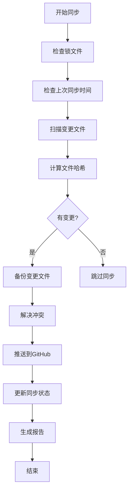
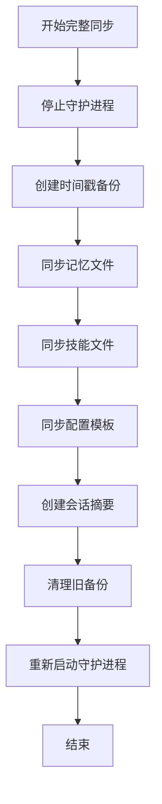

# Hermes 同步策略配置

## 同步策略概述

### 1. 自动同步策略
- **增量同步**: 每小时自动同步变更的文件
- **完整同步**: 每天凌晨2点执行一次完整备份
- **紧急同步**: 检测到重要变更时立即同步

### 2. 同步触发条件
- **文件变更**: 检测到记忆文件或技能文件变更
- **定时触发**: 基于cron定时任务
- **手动触发**: 用户手动执行同步
- **Hermes启动**: 网关启动时自动同步

### 3. 冲突解决策略
- **保留本地**: 默认保留本地版本（安全）
- **智能合并**: 尝试自动合并文本差异
- **备份冲突**: 冲突文件自动备份为冲突版本
- **手动解决**: 严重冲突时提示用户

## 目录结构

```
hermes-memory-project/
├── scripts/
│   ├── sync-manager.sh          # 主同步管理脚本
│   ├── sync-daemon.sh           # 后台同步守护进程
│   ├── backup-hermes.sh         # 基础备份脚本
│   └── incremental-sync.sh      # 增量同步脚本
├── config/
│   ├── sync-config.json         # 同步配置文件
│   └── cron-jobs.txt            # 定时任务配置
├── logs/
│   ├── sync.log                 # 同步日志
│   └── sync-report-*.txt        # 同步报告
├── backups/
│   ├── 20260509_142536/          # 时间戳备份
│   └── incremental/             # 增量备份
└── .sync-state/
    ├── last-sync                # 上次同步时间
    ├── file-hashes              # 文件哈希值
    └── pending-changes          # 待同步变更
```

## 同步流程

### 增量同步流程


### 完整同步流程


## 配置选项

### sync-config.json
```json
{
  "sync_interval": 3600,
  "full_sync_interval": 86400,
  "backup_retention_days": 30,
  "incremental_backup_days": 7,
  "conflict_resolution": "local_first",
  "auto_push": true,
  "push_retries": 3,
  "notification": {
    "enabled": true,
    "email": "user@example.com",
    "on_success": false,
    "on_failure": true
  },
  "exclude_patterns": [
    "*.pyc",
    "__pycache__",
    "node_modules",
    ".git",
    "*.tmp",
    "*.log"
  ],
  "critical_files": [
    "memory/user-profile.md",
    "memory/environment.md",
    "config/config.template.yaml"
  ]
}
```

### cron-jobs.txt
```cron
# Hermes 自动同步定时任务
# 每小时增量同步
0 * * * * cd ~/hermes-memory-project && bash scripts/sync-manager.sh 增量 >> logs/cron.log 2>&1

# 每天凌晨2点完整同步
0 2 * * * cd ~/hermes-memory-project && bash scripts/sync-manager.sh 同步 >> logs/cron.log 2>&1

# 每周日凌晨3点清理旧备份
0 3 * * 0 cd ~/hermes-memory-project && bash scripts/sync-manager.sh 清理 >> logs/cron.log 2>&1

# 每月1号生成同步报告
0 4 1 * * cd ~/hermes-memory-project && bash scripts/sync-manager.sh 报告 >> logs/cron.log 2>&1
```

## 文件变更检测

### 哈希值跟踪
```bash
# 生成文件哈希值
generate_hashes() {
    find . -type f -name "*.md" -o -name "*.yaml" -o -name "*.json" | \
    while read file; do
        md5sum "$file"
    done > .sync-state/file-hashes
}

# 检测变更文件
detect_changes() {
    local old_hashes=".sync-state/file-hashes.old"
    local new_hashes=".sync-state/file-hashes.new"
    
    # 生成新哈希
    generate_hashes > "$new_hashes"
    
    # 比较差异
    diff "$old_hashes" "$new_hashes" | grep "^[<>]" | awk '{print $2}'
}
```

### 监控文件系统
```bash
# 使用inotify监控文件变更
monitor_changes() {
    inotifywait -m -r -e modify,create,delete,move \
        --exclude '(\.git|node_modules|__pycache__|\.tmp)' \
        . |
    while read path action file; do
        echo "$(date): $action $path$file" >> logs/file-changes.log
        # 触发增量同步
        bash scripts/sync-manager.sh 增量
    done
}
```

## 冲突解决策略

### 1. 自动解决策略
- **文本文件**: 使用diff3尝试自动合并
- **二进制文件**: 保留本地版本，备份远程版本
- **配置文件**: 合并配置项，保留用户自定义

### 2. 手动解决流程
```bash
# 查看冲突
git diff

# 手动编辑冲突文件
nano conflicting-file.md

# 标记为已解决
git add conflicting-file.md

# 继续同步
bash scripts/sync-manager.sh 同步
```

### 3. 冲突预防
- **定期提交**: 小步提交，避免大规模冲突
- **清晰注释**: 在文件中添加修改说明
- **分支管理**: 重要修改使用分支

## 性能优化

### 1. 增量备份优化
- **文件哈希缓存**: 缓存文件哈希值，避免重复计算
- **压缩传输**: 使用git压缩传输
- **并行同步**: 并行处理多个文件

### 2. 存储优化
- **重复数据删除**: 识别并删除重复文件
- **压缩存储**: 使用gzip压缩旧备份
- **分层存储**: 热数据本地，冷数据远程

### 3. 网络优化
- **本地缓存**: 缓存GitHub响应
- **断点续传**: 支持中断后继续同步
- **智能重试**: 指数退避重试策略

## 监控和告警

### 监控指标
- **同步成功率**: 成功同步次数/总尝试次数
- **同步延迟**: 从变更到同步的时间差
- **存储使用**: 备份目录大小变化
- **网络流量**: GitHub传输数据量

### 告警条件
- **同步失败**: 连续3次同步失败
- **存储不足**: 磁盘使用率 > 90%
- **冲突过多**: 单次同步冲突数 > 10
- **同步延迟**: 延迟 > 24小时

### 通知方式
- **控制台输出**: 实时同步状态
- **日志文件**: 详细同步记录
- **电子邮件**: 重要告警通知
- **系统通知**: Linux桌面通知

## 安全考虑

### 1. 敏感信息处理
- **过滤API密钥**: 自动替换敏感信息
- **访问控制**: 限制备份目录访问权限
- **加密存储**: 敏感配置加密存储

### 2. 访问控制
- **SSH密钥管理**: 定期轮换SSH密钥
- **仓库权限**: 保持仓库私有
- **审计日志**: 记录所有同步操作

### 3. 数据完整性
- **校验和验证**: 验证文件完整性
- **版本控制**: Git提供版本历史
- **备份验证**: 定期测试恢复流程

## 使用示例

### 手动同步
```bash
# 执行增量同步
bash scripts/sync-manager.sh 增量

# 执行完整同步
bash scripts/sync-manager.sh 同步

# 强制同步（忽略时间限制）
bash scripts/sync-manager.sh 强制

# 查看同步状态
bash scripts/sync-manager.sh 状态
```

### 设置自动同步
```bash
# 安装定时任务
crontab config/cron-jobs.txt

# 启动守护进程
bash scripts/sync-daemon.sh start

# 查看守护进程状态
bash scripts/sync-daemon.sh status
```

### 故障排除
```bash
# 查看同步日志
tail -f logs/sync.log

# 检查冲突文件
git status

# 手动解决冲突
bash scripts/sync-manager.sh 同步

# 重置同步状态
rm -rf .sync-state
bash scripts/sync-manager.sh 同步
```

## 扩展功能

### 1. 多仓库同步
- **配置同步**: 同步多个相关仓库
- **依赖管理**: 管理仓库间依赖关系
- **统一控制**: 单点控制所有同步

### 2. 云存储集成
- **S3备份**: 备份到AWS S3
- **OSS备份**: 备份到阿里云OSS
- **GCS备份**: 备份到Google Cloud Storage

### 3. 团队协作
- **共享配置**: 团队共享基础配置
- **权限管理**: 基于角色的访问控制
- **变更跟踪**: 跟踪团队成员的变更

## 未来规划

### 短期目标（1-3个月）
- [ ] 实现增量同步守护进程
- [ ] 添加文件系统监控
- [ ] 优化冲突解决算法
- [ ] 添加邮件通知功能

### 中期目标（3-6个月）
- [ ] 实现多仓库同步
- [ ] 添加云存储备份
- [ ] 开发Web管理界面
- [ ] 添加团队协作功能

### 长期目标（6-12个月）
- [ ] 实现分布式同步
- [ ] 添加AI辅助冲突解决
- [ ] 开发移动端应用
- [ ] 建立完整的生态系统

---

**更新日期**: $(date)
**维护者**: Hermes Agent
**版本**: 1.0.0